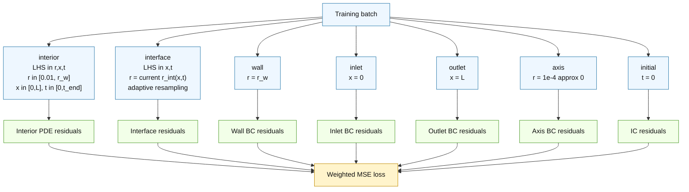

# Current PINN Structure - Sharp Interface Case C

This note documents the current model in the `codex/sharp-interface-verification` branch.
It reflects the active sharp-interface model, not the enthalpy-porosity branch.

Current Case C nondimensional setup:

| Quantity | Value |
|---|---:|
| `Pe` | `14.3` |
| `Ste` | `0.06275` |
| `Re` | `1.53` |
| `k_ratio = k_dep/k_f` | `1.0` |
| `r_a` | `0.0` |
| `r_w` | `1.0` |
| `L` | `10.25` |
| `t_end` | `0.8` |
| `Theta_in` | `2.0` |
| `Theta_solidus` | `1.0` |
| `Theta_wall` | `0.0` |
| `hot_wall_length` | `0.25` |

Temperature nondimensionalization currently used:

$$
\Theta = \frac{T - T_w}{T_{int} - T_w}
$$

For `Tin = 5 C`, `Tint = 0 C`, and `Tw = -5 C`:

$$
\Theta_{in}=2,\qquad \Theta_{int}=\Theta_{solidus}=1,\qquad \Theta_w=0
$$

## Network Architecture

```mermaid
flowchart LR
    classDef input fill:#f5f5f5,stroke:#555,stroke-width:1px,color:#111;
    classDef encode fill:#ffe6e6,stroke:#cc3333,stroke-width:1px,color:#111;
    classDef hidden fill:#eee2ff,stroke:#7a3fd1,stroke-width:1px,color:#111;
    classDef output fill:#e6f7ff,stroke:#1686b8,stroke-width:1px,color:#111;
    classDef physics fill:#e9f8df,stroke:#4c9a2a,stroke-width:1px,color:#111;
    classDef loss fill:#fff4cc,stroke:#c08a00,stroke-width:1px,color:#111;
    classDef train fill:#eeeeee,stroke:#444,stroke-width:1px,color:#111;

    I["Inputs at collocation points<br/>r, x, t"]:::input
    N["Normalize inputs<br/>r_n = r/r_w<br/>x_n = x/L<br/>t_n = t/t_end"]:::input

    I --> N

    subgraph NET["PINNSolidification neural network"]
        direction TB

        subgraph FIELD["Field branch F(r,x,t)"]
            direction TB
            FIn["Field input<br/>(r_n, x_n, t_n)"]:::input
            FEnc["3D FourierEncoding<br/>in_dim=3, features=256<br/>output=512 sin/cos channels<br/>B is frozen, not trainable"]:::encode
            FTrunk["Field MLP trunk<br/>8 x Linear + tanh<br/>hidden width=128"]:::hidden
            FHead["field_head<br/>Linear 128 -> 5"]:::hidden
            FRaw["Raw outputs"]:::hidden
            U["u_r raw<br/>unbounded"]:::output
            UX["u_x raw<br/>unbounded"]:::output
            P["p raw<br/>unbounded gauge pressure"]:::output
            TF["Theta_f = theta_max sigmoid(raw_3)<br/>Case C theta_max=2"]:::output
            TD["Theta_dep = theta_max sigmoid(raw_4)<br/>Case C theta_max=2"]:::output

            FIn --> FEnc --> FTrunk --> FHead --> FRaw
            FRaw --> U
            FRaw --> UX
            FRaw --> P
            FRaw --> TF
            FRaw --> TD
        end

        subgraph INT["Interface branch G(x,t)"]
            direction TB
            IIn["Interface input<br/>(x_n, t_n) only<br/>r is intentionally not used"]:::input
            IEnc["2D FourierEncoding<br/>in_dim=2, features=256<br/>output=512 sin/cos channels<br/>separate frozen B"]:::encode
            ITrunk["Interface MLP trunk<br/>4 x Linear + tanh<br/>hidden width=128"]:::hidden
            IHead["int_head<br/>Linear 128 -> 1"]:::hidden
            RINT["r_int(x,t) = r_w sigmoid(raw)<br/>bounded to [0, r_w]"]:::output

            IIn --> IEnc --> ITrunk --> IHead --> RINT
        end
    end

    N --> FIn
    N --> IIn

    RINT --> H["Smooth region mask<br/>H = 0.5(1 + tanh((r-r_int_detached)/eps))<br/>eps=0.02<br/>H approx 0 fluid, H approx 1 deposit"]:::physics
    U --> RES["Autograd residuals"]:::physics
    UX --> RES
    P --> RES
    TF --> RES
    TD --> RES
    RINT --> RES
    H --> RES

    RES --> PHYS["Physics losses<br/>mass, mom_x, mom_r<br/>energy_fluid, energy_dep<br/>Stefan, T_cont, interface_vel<br/>rint_mono, rint_x_mono"]:::loss
    RES --> BCIC["BC/IC losses<br/>wall, inlet, outlet, axis, initial"]:::loss

    PHYS --> TOTAL["Weighted total loss"]:::loss
    BCIC --> TOTAL

    TOTAL --> OPT["Backpropagation<br/>Phase 1 Adam BC/IC only<br/>Phase 2 Adam + cosine full physics<br/>Phase 3 optional L-BFGS"]:::train
    OPT --> NET
```

Important implementation details:

- The field branch receives `(r, x, t)` and predicts local fields.
- The interface branch receives only `(x, t)`, so `r_int` is independent of the query radius `r` by construction.
- The temperature outputs are bounded by a sigmoid. In Case C, `theta_max = 2`, so both `Theta_f` and `Theta_dep` are constrained to `[0, 2]`.
- `u_r`, `u_x`, and `p` are left unbounded.
- The smooth Heaviside mask uses `r_int.detach()` inside `compute_all_residuals`, so the interior domain mask does not backpropagate directly into the interface head.
- Current detached interface sampling means `T_cont` trains `Theta_f` and `Theta_dep` at the sampled interface location, but does not directly backpropagate into the interface head in the same backward pass. The interface head is trained through Stefan, inlet `r_int` BC, `r_int` IC, `rint_mono`, and `rint_x_mono`.
- TODO: Later test a staged differentiable temperature-continuity path where `T_cont` also backpropagates through `r_int(x,t)` after the temperature field has stabilized. This is not a new physics equation; it would strengthen coupling of the existing interface-temperature condition.
- The old axial curvature penalty `d2r_int/dx2 = 0` has been removed. The current code keeps only `rint_mono` and `rint_x_mono` as interface regularizers.

## Sampling Structure

Current fresh Case C run settings used in `_004`:

| Setting | Value |
|---|---:|
| `phase1_iters` | `1000` |
| `phase2_iters` | `200000` |
| `phase3_iters` | `0` |
| `phase2_lr_start` | `1e-4` |
| `phase2_lr_end` | `1e-5` |
| `N_interior` | `2048` |
| `N_interface` | `1024` |
| `N_boundary` | `512` |
| `N_ic` | `1024` |
| `r_min_interior` | `0.01` |
| `resample_all_every` | `200` |
| `checkpoint_every` | `1000` |
| `plot_every` | `50000` |

## Governing Residuals Used In Loss

Define:

$$
\nabla^2_{cyl} f = \frac{\partial^2 f}{\partial r^2}
+ \frac{1}{r}\frac{\partial f}{\partial r}
+ \frac{\partial^2 f}{\partial x^2}
$$

The implementation clamps `r` internally in singular `1/r` terms for numerical stability.
Interior PDE sampling excludes only the very near-axis region with `r_min_interior = 0.01`; the axis BC remains active separately.

Smooth region mask:

$$
H_\epsilon(r,r_{int}) = \frac{1}{2}\left[1 + \tanh\left(\frac{r-r_{int}}{\epsilon}\right)\right]
$$

Here `H approx 0` in the fluid region `r < r_int`, and `H approx 1` in the deposit region `r > r_int`.

Mass:

$$
R_{mass} = (1-H)\left(
\frac{\partial u_r}{\partial r}
+ \frac{u_r}{r}
+ \frac{\partial u_x}{\partial x}
\right)
$$

Axial momentum:

$$
R_{mom,x} = (1-H)\left(
\frac{1}{Pe}\frac{\partial u_x}{\partial t}
+ u_r\frac{\partial u_x}{\partial r}
+ u_x\frac{\partial u_x}{\partial x}
+ \frac{\partial p}{\partial x}
- \frac{1}{Re}\nabla^2_{cyl}u_x
\right)
$$

Radial momentum:

$$
R_{mom,r} = (1-H)\left(
\frac{1}{Pe}\frac{\partial u_r}{\partial t}
+ u_r\frac{\partial u_r}{\partial r}
+ u_x\frac{\partial u_r}{\partial x}
+ \frac{\partial p}{\partial r}
- \frac{1}{Re}\left(\nabla^2_{cyl}u_r - \frac{u_r}{r^2}\right)
\right)
$$

Fluid energy:

$$
R_{E,f} = (1-H)\left(
\frac{\partial \Theta_f}{\partial t}
+ Pe\left(
 u_r\frac{\partial \Theta_f}{\partial r}
+ u_x\frac{\partial \Theta_f}{\partial x}
\right)
- \nabla^2_{cyl}\Theta_f
\right)
$$

Deposit energy:

$$
R_{E,dep} = H\left(
\frac{\partial \Theta_{dep}}{\partial t}
- k_{ratio}\nabla^2_{cyl}\Theta_{dep}
\right)
$$

Stefan condition at the interface points:

$$
R_{Stefan} =
\frac{\partial r_{int}}{\partial t}
- Ste\left(
k_{ratio}\frac{\partial \Theta_{dep}}{\partial r}
- \frac{\partial \Theta_f}{\partial r}
\right)
$$

Temperature continuity and interface temperature:

$$
R_{T,f} = \Theta_f(r_{int},x,t) - \Theta_{solidus}
$$

$$
R_{T,dep} = \Theta_{dep}(r_{int},x,t) - \Theta_{solidus}
$$

Interface monotonic penalties:

$$
R_{rint,t} = \max\left(0,\frac{\partial r_{int}}{\partial t}\right)
$$

$$
R_{rint,x} = \max\left(0,\frac{\partial r_{int}}{\partial x}\right)
$$

No current loss term penalizes `d2r_int/dx2`.

Interface velocity no-slip:

$$
R_{u,\Gamma,x}=u_x(r_{int},x,t)
$$

$$
R_{u,\Gamma,r}=u_r(r_{int},x,t)
$$

## Boundary And Initial Conditions

Wall, `r = r_w`:

$$
\Theta_{dep}(r_w,x,t) = \Theta_w(x),\qquad u_r(r_w,x,t)=0,\qquad u_x(r_w,x,t)=0
$$

where:

$$
\Theta_w(x)=
\begin{cases}
\Theta_{in}, & 0 \le x \le 0.25 \\
\Theta_{wall}, & x > 0.25
\end{cases}
$$

Inlet, `x = 0`:

$$
\Theta_f(r,0,t)=\Theta_{in},\qquad u_r(r,0,t)=0
$$

$$
u_x(r,0,t)=2\left[1-\left(\frac{r}{r_{int}(0,t)}\right)^2\right]
$$

$$
r_{int}(0,t)=r_w
$$

Outlet, `x = L`:

$$
\frac{\partial \Theta_f}{\partial x}(r,L,t)=0,
\qquad
\frac{\partial u_x}{\partial x}(r,L,t)=0
$$

Axis, implemented at `r = 1e-4 approx 0`:

$$
u_r(0,x,t)=0,
\qquad
\frac{\partial \Theta_f}{\partial r}(0,x,t)=0,
\qquad
\frac{\partial u_x}{\partial r}(0,x,t)=0
$$

Initial condition, `t = 0`:

$$
r_{int}(x,0)=r_w,
\qquad
\Theta_f(r,x,0)=\Theta_{in},
\qquad
u_r(r,x,0)=0
$$

$$
u_x(r,x,0)=2(1-r^2)
$$

## Loss Assembly

Every residual is converted to MSE:

$$
MSE(R)=\frac{1}{N}\sum_{i=1}^{N}R_i^2
$$

Current weighted loss terms:

$$
L_{mass}=1\,MSE(R_{mass})
$$

$$
L_{mom,x}=1\,MSE(R_{mom,x}),\qquad
L_{mom,r}=1\,MSE(R_{mom,r})
$$

$$
L_{E,f}=1\,MSE(R_{E,f}),\qquad
L_{E,dep}=1\,MSE(R_{E,dep})
$$

$$
L_{Stefan}=10\,MSE(R_{Stefan})
$$

$$
L_{Tcont}=100\cdot0.5\left[MSE(R_{T,f})+MSE(R_{T,dep})\right]
$$

$$
L_{interface\_vel}=10\cdot0.5\left[MSE(R_{u,\Gamma,x})+MSE(R_{u,\Gamma,r})\right]
$$

$$
L_{rint}=10\,MSE(R_{rint,t})+10\,MSE(R_{rint,x})
$$

The BC/IC term is the average MSE over all present BC and IC residual arrays, then multiplied by `100`:

$$
L_{BC/IC}=100\,\frac{1}{N_{groups}}\sum_j MSE(R_{BC/IC,j})
$$

Full physics training uses:

$$
L_{total}=
L_{mass}+L_{mom,x}+L_{mom,r}+L_{E,f}+L_{E,dep}
+L_{Stefan}+L_{Tcont}+L_{interface\_vel}+L_{rint}+L_{BC/IC}
$$

Phase 1 uses only:

$$
L_{total}=L_{BC/IC}
$$
