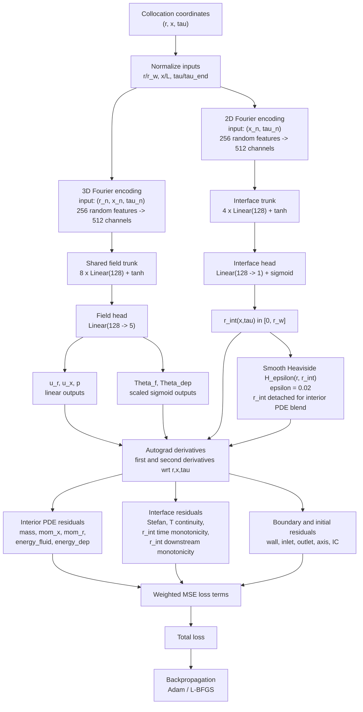

# PROJECT STATE
> **Auto-maintained by Claude.** Updated at every milestone or model logic change.  
> Last updated: 2026-05-15 | Phase: **6 - Sharp-Interface Verification Cases** In Progress

---

## 1. Project Summary

**Title:** Physics-Informed Neural Networks (PINNs) as a CFD Surrogate for 2D Axisymmetric Pipe Solidification with Phase Change

**PhD Context:**  
This project develops a PINN-based surrogate model to replace conventional CFD (currently implemented in MATLAB) for a pipe solidification problem. Liquid flowing through a pipe solidifies against a cold outer wall, forming a growing deposit layer. The PINN takes the space-time coordinates $(r, x, \tau)$ as inputs and predicts all field variables as outputs, learning the governing physics through a composite PDE residual loss rather than labelled data.

**Governing Physics (2D axisymmetric conservative form):**
- Mass conservation (fluid)
- Axial + radial momentum (Navier–Stokes, laminar)
- Fluid energy equation (advection–diffusion)
- Deposit (solid) energy equation (pure diffusion)
- Stefan condition at the moving solid-liquid interface $r_\text{int}(x,\tau)$

**Active verification case: `20260410_nonDimm_goodmatchCaseB`**
| Parameter | Value |
|---|---|
| Diameter Peclet number Pe_D | 14.329521 |
| Stefan number Ste | 0.06275 |
| Diameter Reynolds number Re_D | 1.53 |
| Conductivity ratio | $k_{dep}/k_f=1.0$ |
| Geometry | $r_a=0$, $r_w=1$, $A=L_{total}/r_w=10.25$ |
| Dimensional temperatures | $T_{in}=5 C$, $T_{int}=0 C$, $T_w=-5 C$ |
| Non-dimensional temperatures | $\Theta_{in}=2$, $\Theta_{solidus}=1$, $\Theta_w=0$ |
| Wall BC | $\Theta_w=\Theta_{in}=2$ for $0\le x\le0.25$, then $\Theta_w=0$ downstream |
| IC | Clean pipe, $r_{int}=1$, $\Theta_f=2$ |
| End time | $\tau_{end}=8/10.25=0.780487804878$ |

**Historical benchmark / simple test case, not active for Case B:**
| Parameter | Value |
|---|---|
| Péclet number Pe | 1.0 |
| Stefan number Ste | 0.1 |
| Reynolds number Re | 10 (laminar) |
| Geometry | $r_a=0$, $r_w=1$, $L=5$ (non-dim) |
| Wall BC | $\Theta_w = 0$ (cold, Dirichlet) |
| Inlet BC | $\Theta_{in} = 1$, Poiseuille $u_x$ |
| IC | Clean pipe, $r_{int}=1$, $\Theta_f=1$ |
| End time | $\hat{t}=1.0$ (one thermal diffusion time) |

---

## 2. Current Phase

**Phase 6 - Sharp-Interface Verification Cases**
Status: In Progress

Completed sub-tasks:
- [x] Governing equations derived in 2D axisymmetric conservative form
- [x] Non-dimensional groups defined for the active case (`Pe_D`, `Re_D`, `Ste`, `A`, `tau_end`)
- [x] Roadmap and project files initialised
- [x] `config.py` — case parameters and non-dim scales
- [x] `network.py` — Fourier-encoded MLP with field + interface heads
- [x] `equations.py` — autograd PDE residuals (R1–R7 + all BCs/ICs)
- [x] `sampling.py` — Latin Hypercube interior, adaptive interface, boundary/IC samplers, plot_batch
- [x] `losses.py` — named weighted terms, Phase 1 fast path, compute_loss, format_loss_line, log_to_csv
- [x] `train.py` - three-phase training loop, smoke mode, checkpoint/resume, CSV logging
- [x] `postprocess.py` - dense-grid plots, residual maps, optional MATLAB interface overlay
- [x] Smoke verification: `python train.py --smoke`, resume from `checkpoints/latest.pth`, and small-grid `postprocess.py`
- [x] Added `diagnose_residuals.py` raw residual RMS diagnostics and ran it on the iter 800 reduced-case checkpoint
- [x] Added and ran `train_no_phase.py` clean-pipe no-phase diagnostic to separate phase-change coupling from momentum/energy residuals
- [x] Created branch `codex/sharp-interface-verification` from sharp-interface commit `a18a6cd`
- [x] Added verification case `20260410_nonDimm_goodmatchCaseB` to `config.py`
- [x] Smoke verified training path and direct `latest.pth` checkpoint saving for the verification case
- [x] Added `SHARP_INTERFACE_EQUATIONS.md` with the implemented nondimensional PDEs, interface conditions, BC/ICs, and loss weights
- [x] Converted active Case B implementation to Excel-consistent nondimensionalization with convective $\tau$ and diameter-based $Pe_D, Re_D$
- [ ] Run bounded/full verification training against supplied MATLAB/sample cases.

---

## 3. Architecture Memory

### 3.1 Network Design (v1.1)

| Property | Value | Rationale |
|---|---|---|
| Input | $(r, x, \tau)$, internally scaled to $(r/r_w, x/L, \tau/\tau_{end})$ | Keeps Fourier features on comparable coordinate ranges while autograd still differentiates w.r.t. physical non-dimensional coordinates |
| Fourier encoding | $\sigma=1.0$, 256 features | Overcomes spectral bias near interface |
| Shared trunk | 8 × 128, tanh | Tanh preferred over ReLU for smooth second derivatives needed by PDE residuals |
| Field head | → $(u_r, u_x, p, \Theta_f, \Theta_{dep})$ | Linear outputs except $\Theta$ use sigmoid scaled to the active case temperature range |
| Interface head | Input masked to $(x, \tau)$ -> $r_{int}$ | Sigmoid output scaled to $(0,1)$ |
| Total params | ~297k | Small enough for smoke checks, intended production runs on GPU |

**Decision log:**
- Single-network with two heads chosen over two separate networks (fluid + solid) to avoid discontinuous gradients at the interface during backpropagation.
- Smooth Heaviside $H_\epsilon(r, r_{int})$ with $\epsilon=0.02$ used to blend fluid and deposit PDE residuals, avoiding hard domain splitting.

### 3.2 Loss Function Configuration (v1.0)

| Term | Equation | Weight | Evaluated on |
|---|---|---|---|
| $\mathcal{L}_1$ | Mass conservation | 1 | Interior collocation $\mathcal{P}_\Omega$ |
| $\mathcal{L}_2$ | Axial momentum | 1 | Interior collocation |
| $\mathcal{L}_3$ | Radial momentum | 1 | Interior collocation |
| $\mathcal{L}_4$ | Fluid energy | 1 | Interior collocation |
| $\mathcal{L}_5$ | Deposit energy | 1 | Interior collocation |
| $\mathcal{L}_6$ | Stefan condition | 10 | Interface points $\mathcal{P}_\Gamma$ |
| $\mathcal{L}_7$ | $T$ continuity at interface | 100 | Interface points |
| $\mathcal{L}_{u,\Gamma}$ | No-slip velocity at interface, $u_x=u_r=0$ | 10 | Interface points |
| $\mathcal{L}_{r,\tau}$ | Monotone interface motion, penalize $\partial r_{int}/\partial \tau > 0$ | 10 | Interface points |
| $\mathcal{L}_{r,x}$ | Monotone downstream interface, penalize $\partial r_{int}/\partial x > 0$ | 10 | Interface points |
| $\mathcal{L}_8$ | All BCs + IC, including inlet $r_{int}(0,\tau)=r_w$ | 100 | Boundary/initial points |

**Collocation counts:** 20k interior, 5k interface (resampled every 500 iters), 2k per boundary, 5k IC.

### 3.3 Training Protocol (v1.0)

| Phase | Iters | Optimizer | LR | Loss active |
|---|---|---|---|---|
| 1 - BC/IC pre-train | 0-2k | Adam | $10^{-3}$ | $\mathcal{L}_8$ only |
| 2 - Full physics | 2k-40k | Adam + cosine anneal | $10^{-3} \to 10^{-5}$ | All terms |
| 3 - Refinement | 40k-50k | L-BFGS | 1.0 | All terms |

Implementation notes:
- `train.py --smoke` runs tiny CPU-safe counts while preserving full default settings for production runs.
- Checkpoints include model, optimizer, scheduler, phase, iteration, best loss, config snapshot, and RNG state.
- `postprocess.py` produces PINN-only plots without MATLAB data and overlays MATLAB interface data when `outputs/matlab_ref.mat` is available.

### 3.4 Current End-to-End PINN Structure

**Forward inputs.**
- The model receives pointwise non-dimensional coordinates $(r,x,\tau)$.
- Before Fourier encoding, the network scales them internally to $(r/r_w,\ x/L,\ \tau/\tau_{end})$.
- Autograd still differentiates with respect to the original coordinate tensors used by the residual functions.

**Field branch.**
- Uses all three normalized coordinates $(r_n,x_n,\tau_n)$.
- Random Fourier encoding maps 3 inputs to 512 encoded channels.
- A shared MLP trunk with 8 hidden layers and 128 tanh units predicts the field state.
- The field head outputs $(u_r,u_x,p,\Theta_f,\Theta_{dep})$.
- $u_r$, $u_x$, and $p$ are linear outputs; $\Theta_f$ and $\Theta_{dep}$ pass through sigmoid bounds scaled to the active case temperature range.

**Interface branch.**
- Uses only $(x_n,\tau_n)$, not $r_n$, so the learned interface is physically $r_{int}(x,\tau)$.
- A separate 2D Fourier encoder feeds a 4-layer tanh trunk.
- The interface head outputs $r_{int}$ through `sigmoid * r_w`, keeping it inside $[0,r_w]$.

**Region handling.**
- A smooth Heaviside function $H_\epsilon(r,r_{int})$ marks fluid/deposit regions.
- In the interior PDE residuals, $r_{int}$ is detached inside $H_\epsilon$ so interior PDE blending does not create an unwanted shortcut into the interface head.

**Loss assembly.**
- Interior collocation points enforce mass, momentum, and energy equations.
- Interface points enforce Stefan balance, temperature continuity, interface no-slip velocity, monotone solidification, and downstream front monotonicity.
- Boundary and initial points enforce wall, inlet, outlet, axis, and clean-pipe initial conditions.
- Each residual group becomes a weighted MSE term; the total loss is the sum of all active terms.

**Training flow.**
- Phase 1 uses BC/IC only, so the network first learns the known inlet/wall/axis/outlet/initial states.
- Phase 2 enables all PDE and interface losses with Adam and cosine learning-rate decay.
- Phase 2 now periodically resamples the full collocation batch, not only interface points, to prevent fixed-batch PDE overfitting.
- Phase 3 optionally refines the full-physics solution with L-BFGS.

---

## 4. Key Technical Decisions Log

| Date | Decision | Reason |
|---|---|---|
| 2026-04-29 | Chosen single MLP + smooth Heaviside over sharp domain split | Avoids discontinuous interface gradient in backprop |
| 2026-04-29 | Fourier feature encoding with $\sigma=1.0$ | PINNs have spectral bias; Fourier encoding enables high-freq spatial modes |
| 2026-04-29 | Interface head masked to $(x,\tau)$ only | $r_{int}$ is physically 1D (no $r$-dependence) - encoding this as an inductive bias |
| 2026-04-29 | Stefan and BC losses weighted 10× and 100× | These are hard constraints; PDE residuals are softer |
| 2026-04-29 | `.pth` files gitignored; `BEST_MODELS.md` tracked | Prevents repo bloat; maintains version record for thesis |
| 2026-04-29 | `_grad` uses `grad_outputs=ones` + `allow_unused=True` | Standard batch-PINN gradient; allow_unused avoids crash when interface head receives r=0 gradient |
| 2026-04-29 | Cylindrical Laplacian clamps r to `_R_MIN=1e-6` | Prevents NaN at axis r=0; affects only axis-adjacent points |
| 2026-05-15 | Switched active verification nondimensionalization to Excel-consistent Case B | Physics now uses $r=r_{dim}/r_w$, $x=x_{dim}/r_w$, $\tau=t_{dim}U/L_{total}$, and diameter-based $Pe_D,Re_D$ to match the Fluent inputs derived from Excel |
| 2026-04-29 | H_ε uses `.detach()` on r_int when computing Heaviside | Prevents gradient from flowing through H into interface head during interior PDE residuals |
| 2026-04-29 | Pure-PyTorch LHS (no scipy) in sampling.py | Portability: avoids scipy dependency; stratification verified by bincount test |
| 2026-04-29 | Axis points use r=1e-4, not r=0 | Avoids 1/r singularity in _laplacian_cyl; safely above _R_MIN=1e-6 |
| 2026-04-29 | sample_interface detaches r_int and re-wraps with requires_grad | Prevents stale computation graph references across training iterations |
| 2026-04-29 | resample_interface uses advancing seed each call | Ensures fresh $(x,\tau)$ pairs every resample step; same seed gives reproducible samples |
| 2026-04-29 | Phase 1 fast path `_compute_bc_ic_residuals` skips Laplacians | No second-order autograd in pre-train → ~10× faster per step |
| 2026-04-29 | 16 BC/IC residuals averaged before applying `w_bc_ic` weight | Prevents large-N BC sets from dominating; each sub-term contributes equally |
| 2026-04-29 | R7 (T_cont) averages fluid + deposit continuity, ×0.5 | Both must be satisfied symmetrically; prevents double-counting |
| 2026-04-29 | `log_to_csv` appends rows with `write_header` flag | Single function used throughout training; header written once at iter 0 |
| 2026-04-29 | Added three-phase `train.py` with smoke mode and full resume checkpoints | Enables careful CPU verification locally while preserving 50k-iteration production defaults |
| 2026-04-29 | Added `postprocess.py` with optional MATLAB interface overlay | PINN plots and residual maps are available before MATLAB reference export exists |
| 2026-04-29 | Raised interface temperature-continuity weight from 10 to 100 | Reduced CPU case had high $T$-continuity loss, so the interface temperature must be treated as a harder constraint |
| 2026-04-29 | Added inlet interface anchor, time monotonicity, downstream monotonicity, and axial smoothness losses | Iter 1600 CPU case found local interface collapse near interior x; these terms target that optimizer shortcut directly |
| 2026-04-29 | Network v1.1 normalizes coordinates before Fourier encoding | The previous v1.0 interface saw x on $[0,5]$ but r and the old time coordinate on $[0,1]$, creating excess high-frequency axial oscillation |
| 2026-04-29 | Corrected Stefan residual scaling to $\dot r_{int}=\text{Ste}\,\Delta q$ | The old form used $\text{Ste}\,\dot r_{int}=\Delta q$, making Ste=0.1 move the interface about 100x too fast |
| 2026-04-29 | Made checkpoint write failures non-fatal and reduced best-checkpoint write frequency | OneDrive/disk pressure caused checkpoint writes to fail and interrupt training; source code should not be lost because an artifact write fails |
| 2026-04-30 | Added raw residual RMS diagnostic script and ran it on the iter 800 reduced-case checkpoint | The weighted loss alone hid the source of the error; diagnostics showed near-axis radial momentum spikes dominate the weighted loss, while fluid energy is the next largest broad residual |
| 2026-04-30 | Added clean-pipe no-phase diagnostic trainer with $H=0$ and interface losses disabled | Constant-temperature no-phase runs show the same near-axis residual pathology, so the immediate blocker is axis regularity/sampling rather than Stefan or interface coupling |
| 2026-04-30 | Tested the mild axis treatment: exclude only interior PDE points with $r<0.01$ while keeping axis BC points | The no-phase clean-pipe residuals became well conditioned: after 1000 iters, fresh RMS values were $R_{mom,x}=1.34$, $R_{mom,r}=0.634$, $R_E=0.263$, and $R_{mass}=0.213$ |
| 2026-04-30 | Ran a 2000-iter no-phase clean-pipe case and generated field/residual plots | Fresh residuals improved to $R_{mom,x}=0.820$, $R_{mom,r}=0.359$, $R_E=0.118$, and $R_{mass}=0.155$; temperature is nearly constant, but the velocity field still needs refinement before returning to the full phase-change case |
| 2026-04-30 | Continued the no-phase run to iter 10000 with a target fresh RMS of $10^{-3}$ | Target was not reached: energy converged to $R_E=0.00192$, but momentum remained at $R_{mom,x}=0.278$, $R_{mom,r}=0.0804$; this points to axial momentum/pressure conditioning rather than insufficient phase-change handling |
| 2026-04-30 | Installed CUDA-enabled PyTorch in Python 3.12 and verified GPU execution without source-code changes | CUDA run used the same no-phase equations and scripts; after 500 GPU Adam steps from iter 10000, fresh residuals were $R_{mom,x}=0.248$, $R_{mom,r}=0.192$, $R_E=0.00127$, and $R_{mass}=0.0785$ |
| 2026-04-30 | Ran a long CUDA no-phase continuation to iter 30500 with larger collocation counts | Target $10^{-3}$ was not reached, but residuals improved to $R_{mass}=0.0538$, $R_{mom,x}=0.0495$, $R_{mom,r}=0.0318$, and $R_E=3.67\times10^{-5}$; plain Adam still plateaus above the desired momentum accuracy |
| 2026-04-30 | Continued the same CUDA no-phase case to iter 80500 with unchanged equations/code | Target $10^{-3}$ was still not reached. Fresh residuals were $R_{mom,x}=1.78\times10^{-2}$, $R_{mom,r}=1.32\times10^{-2}$, $R_{mass}=4.53\times10^{-3}$, and $R_E=8.70\times10^{-6}$. Postprocess plots show constant $\Theta_f=1$, near-Poiseuille $u_x$ with max 1.9996, very small $u_r$, and a smooth pressure drop. Accumulated active training time from the initial no-phase checkpoint to iter 80500 was about 2 h 9 min, excluding conversation gaps/postprocessing |
| 2026-05-02 | Added full collocation resampling, lower-LR weight-only resume, LR CLI overrides, and robust latest-checkpoint overwrite | The first phase-change rerun with interface-only resampling had fresh weighted loss $3.90\times10^2$ at iter 6000 because fixed interior PDE points hid energy residual spikes. Full-batch resampling reduced fresh weighted loss to $6.89\times10^{-1}$ at iter 12000; lower-LR larger-batch refinement reduced it further to $3.32\times10^{-1}$ at iter 50000. The remaining largest terms are BC/IC, $T$ continuity, and fluid energy, while Stefan/momentum are small |
| 2026-05-12 | Updated verification-case temperature scale to $\Theta=(T-T_w)/(T_{int}-T_w)$ and scaled temperature heads by the active case temperature maximum | The active case has $\Theta_{in}=2$, $\Theta_{solidus}=1$, and $\Theta_w=0$; unscaled sigmoid temperature outputs capped at 1 could not satisfy the inlet and IC |
| 2026-05-12 | Added postprocess deposit-thickness plot `thickness_profiles.png` | Verification needs direct plots of nondimensional thickness $r_w-r_{int}$ versus nondimensional $x$; default Case B snapshots now use $\tau=2/10.25,4/10.25,6/10.25,8/10.25$ |
| 2026-05-12 | Removed the interface axial-curvature loss $\mathcal{L}_{r,xx}$ | The verification branch now keeps the governing equations plus the interface time/downstream monotonicity penalties, without penalizing $\partial^2 r_{int}/\partial x^2$ |
| 2026-05-12 | Extended the verification geometry to $L=10.25$ and added a hot-wall inlet section over $0\le x\le0.25$ | This represents the upstream non-deposition segment: the wall uses $\Theta_w=\Theta_{in}$ there and remains cold downstream |
| 2026-05-14 | TODO: test staged differentiable $T_{cont}\rightarrow r_{int}$ coupling | Current detached interface sampling makes $T_{cont}$ train $\Theta_f$ and $\Theta_{dep}$ at sampled interface points, but not the interface head in the same backward pass. Future work should test allowing the existing temperature-continuity condition to backprop through $r_{int}(x,\tau)$ after the temperature field is stable; this is not a new physics equation. |
| 2026-05-14 | Added interface no-slip velocity loss $\mathcal{L}_{u,\Gamma}$ | The previous sharp-interface loss enforced no-slip only at the outer wall. Once deposit exists, the fluid boundary is $r_{int}(x,\tau)$, so the full-physics loss now also penalizes $u_x$ and $u_r$ at the sampled interface points. |
| 2026-05-14 | Checkpoint-aware diagnostics/postprocess and best-checkpoint metadata fix | `postprocess.py` and `diagnose_residuals.py` now rebuild the run config from the checkpoint payload, residual maps use the same `r_min_interior` as training, and best checkpoints store the actual new best loss immediately when saved. |
| 2026-05-14 | Added zero-derivative guard in `_grad` | Higher-order derivatives of constant tensors now return zero instead of depending on PyTorch-version-specific autograd behavior. This preserves the mathematical derivative and makes derivative tests robust. |

---

## 5. Autonomous Update Instructions

> **For Claude:** The following rules are mandatory and must be followed in every future session working on this project.

1. **At every milestone** (new file implemented, training phase completed, architecture changed, verification result obtained): update this file immediately before ending the session.
2. **When the network architecture changes**: update Section 3.1 with a new version number (e.g. v1.1) and record the old config inline as a strikethrough or sub-entry.
3. **When loss weights or training protocol change**: update Section 3.2/3.3 with the new values and log the reason in Section 4.
4. **When a verification run completes**: add a summary row to `Verification_Log.md` and update Section 2 checkboxes.
5. **Always update the `Last updated` date and `Phase` tag** at the top of this file.
6. **Never** leave the project in a state where `PROJECT_STATE.md` is stale relative to the code — if the code and this file disagree, fix this file first.
